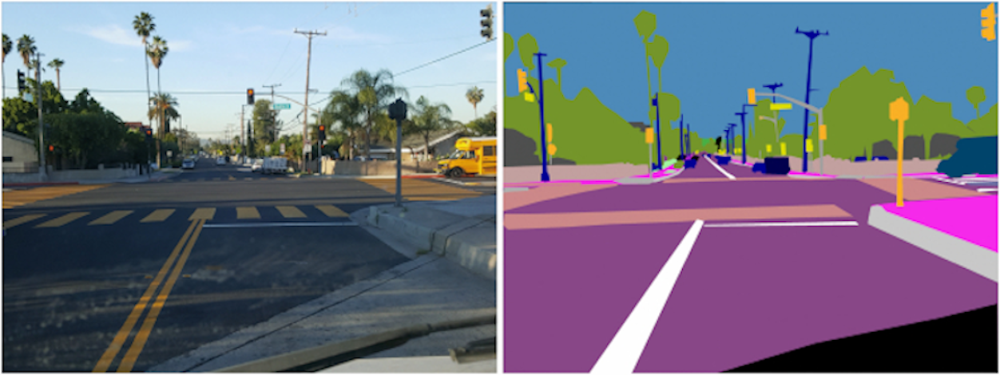

# Semantic Segmentation for Self-Driving Cars

Semantic Segmentation is an Image Classification task where you a label **each pixel** of an image with a corresponding **class** that it belongs to. For example, the "Traffic Signs" are represnted by a yellow mask over them, while the "lamp posts" are represnted by a blue mask.

